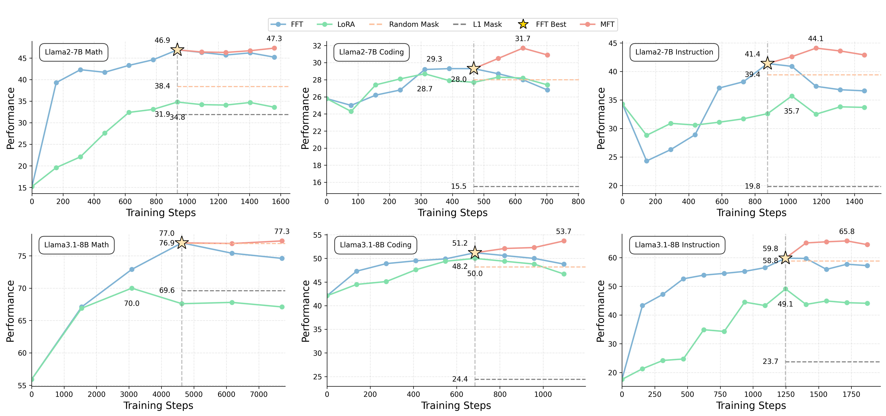

# Mask-finetune for LLMs
arxiv: **Boosting Large Language Models with Mask Fine-Tuning** [https://arxiv.org/abs/2503.22764]

**Table of Contents**

1. [News](#news-%EF%B8%8F)
2. [Overview](#overview)
3. [Training](#training)
    - [Installation](#installation)
    - [FFT](#fft)
    - [MFT](#mft)
4. [Evaluation](#evaluation)
    - [Installation](#installation-1)
    - [Evaluate](#evaluate)
5. [Citation](#citation)

## News 🗞️

* **🔥 [2025/04/14]:** We release the code for **Coding Domain on LLaMA2-7B**!
* **🔥 [2025/03/26]:** We release the code for **Math Domain on LLaMA2-7B**!

## Overview

Our experiments compares FFT, LoRA, and our proposed MFT on GSM8K (math), HumanEval (coding), and IF-Eval (instruction) tasks using LLaMA2 and LLaMA3.1 models. Our MFT method surpasses FFT (which overfits), LoRA, and mask baselines, effectively breaking the fine-tuning performance upper bound.



This repository includes all the main experiments from our paper:

- `bash`: contains the bash for training and evaluation:
    - `evaluation`: contains the bash for evaluation.
    - `training`: contains the bash for training.
- `configs`: contains the configs for training:
    - `ds_configs`: contains the configs for Deepspeed.
    - `train_configs`: contains training hyperparameters.
- `scripts`: contains all scripts that we use for training.

## Training

### Installation

Let's first build the virtual environment for training:

```shell
conda create -n mft python=3.10 -y
conda activate mft
bash setup_train_env.sh
```

Before training, you need to modify the WANDB_API_KEY and HF_TOKEN in the training bash file, as well as the machine settings to compile with your machine.

### Quickstart

```shell
conda activate mft
cd MFT
bash <path_to_config>
```

**Example:**

#### FFT

```shell
conda activate mft
cd MFT
bash bash/training/run_fft_llama2-7b_math.sh
```

#### MFT

```shell
conda activate mft
cd MFT
bash bash/training/run_local_masktune_llama2-7b_math.sh
```

The checkpoints will be saved in a folder named `output/<model name>`.

## Evaluation

We use `olmes` to evaluate models, with tasks defined in `olmes/oe_eval/tasks/oe_eval_tasks`. We use `pass@1` as the metric for all tasks.

### Installation

```shell
conda create -n olmes python=3.10 -y
conda activate olmes
bash setup_eval_env.sh
```

### Apply Learned Mask

In the training bash, the learned mask will be automatically applied to the fft model. The model applied with the mask will be saved in a folder named "mask_applied" in the output folder.

If you already have a mask (usually saved as `masks.pt`), you can directly apply it to the corresponding model using following command:

```shell
python scripts/apply_masks.py \
    --base_model_name_or_path <path_to_base_model> \
    --masks_file <path_to_saved_masks> \
    --output_dir <path_to_output-dir>/mask_applied
```

#### LLaMA2-7B

**Math Domain:**

| Task  | Fully-finetune | Mask-finetune                      |
|:------|:--------------:|:----------------------------------:|
| GSM8K | 46.8           | 47.4 <b>↑</b></span><sub>0.6</sub> |
| MATH  | 6.7            | 7.6 <b>↑</b></span><sub>0.9</sub>  |

To reproduce these results use the following command:

```shell
conda activate olmes
cd MFT
bash bash/evaluation/llama2-7b_math.sh fft_7b_math
bash bash/evaluation/llama2-7b_math.sh masktune_7b_local_4-7-layers_0.9_math
```

The evaluation results will be saved to a folder named in **eval_output** in `output/fft_7b_math` and `output/masktune_7b_local_4-7-layers_0.9_math/mask_applied`.

**Coding Domain:**

| Task       | Fully-finetune | Mask-finetune                      |
|:-----------|:--------------:|:----------------------------------:|
| HumanEval  | 29.9           | 33.5 <b>↑</b></span><sub>3.6</sub> |
| HumanEval+ | 25.0           | 29.9 <b>↑</b></span><sub>4.9</sub> |

To reproduce these results use the following command:

```shell
conda activate olmes
cd MFT
bash bash/evaluation/llama2-7b_coding.sh fft_7b_coding
bash bash/evaluation/llama2-7b_coding.sh masktune_7b_local_20-23-layers_0.9_coding
```

The evaluation results will be saved to a folder named in **eval_output** in `output/fft_7b_coding` and `output/masktune_7b_local_20-23-layers_0.9_coding/mask_applied`.

## Citation

If you find this project is useful in your own work, please consider citing as follows:

```
@misc{zhang2025boostinglargelanguagemodels,
      title={Boosting Large Language Models with Mask Fine-Tuning}, 
      author={Mingyuan Zhang and Yue Bai and Huan Wang and Yizhou Wang and Qihua Dong and Yun Fu},
      year={2025},
      eprint={2503.22764},
      archivePrefix={arXiv},
      primaryClass={cs.CL},
      url={https://arxiv.org/abs/2503.22764}, 
}
```